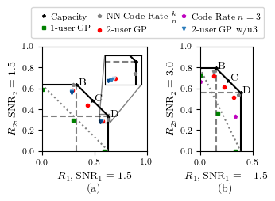

# NN Code
## a simple, neural-network based, arbitrary-rate single user code
### with application to multi user channels

This repository contains the code to generate the codes in the NN-Code paper, in which the authors present a neural network architecture for arbitrary rate single user codes and then show that these codes can be used to operate close to the capacity of the multiple access channel (MAC) via a proposed successive interference cancellation (SIC) -like algorithm which is scalable to many users.  The arbitrary rate nature of the network, makes the family of codes flexible to operate as close or as far from the calculated capacity of the channel as desired, maximizing either the goodput or minimizing the BER. 

